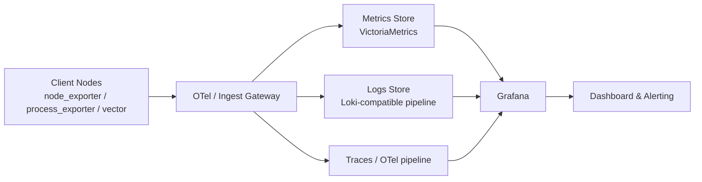

# Observability.svc.plus

[](LICENSE)
[](https://svc.plus)

**Observability.svc.plus** is an observability solution strictly following the Apache 2.0 license.

> **Focus**: Monitoring & Observability (监控/可观测). Integrating OpenTelemetry (OTel), VictoriaMetrics, and DeepFlow-based network observability without long-term raw-flow lock-in.

[Website](https://svc.plus/) | [Public Demo](https://svc.plus/services) | [Blog](https://svc.plus/blogs) | [Support](https://www.svc.plus/support)

[](https://observability.svc.plus)

## 1) 概述

Observability.svc.plus provides a monitoring-focused stack for infrastructure and applications, centered on metrics, logs, and traces. It is designed for self-hosted, cloud-neutral operations with minimal vendor lock-in.

## 2) 架构图



## 3) Start

当前推荐按“混合部署到已有主机”的方式执行。

1. 先更新 DNS，把 `observability.svc.plus` 指到 `us-xhttp.svc.plus`
2. 在 `us-xhttp.svc.plus` 上执行下面的 Server side 示例，部署中心端
3. 再到其他已有主机执行下面的 Client side 示例，把采集数据回传到 `observability.svc.plus`

当前接入主机：

- `us-xhttp.svc.plus`：继续承载现有服务，同时承载 `observability.svc.plus`
- `openclaw.svc.plus`：部署 agent，采集后上报到中心端
- `jp-xhttp.svc.plus`：部署 agent，采集后上报到中心端

### Ansible (Recommended)

#### Server side

先导出 Cloudflare Token，然后在 `us-xhttp.svc.plus` 上执行服务端部署。`deploy_observability_service.yml` 会先把 Cloudflare 上的 `observability.svc.plus` 更新成指向 `us-xhttp.svc.plus` 的非代理记录，再等待公共 DNS 生效后继续部署，这样更容易保证 Caddy 首次自动签名成功。

```bash
export CLOUDFLARE_API_TOKEN=...
ansible-playbook -i <your-inventory> deploy_observability_service.yml -l us-xhttp.svc.plus
```

如果希望给 `/ingest/*` 增加一层基础认证，可以在服务端部署时一起打开：

```bash
export CLOUDFLARE_API_TOKEN=...
ansible-playbook -i <your-inventory> deploy_observability_service.yml -l us-xhttp.svc.plus \
  -e observability_ingest_basic_auth_enabled=true \
  -e observability_ingest_basic_auth_user=ingest \
  -e observability_ingest_basic_auth_password='<strong-password>'
```

#### Client side (agent)

再到采集端主机执行 `node.yml` 的 push mode：

```bash
ansible-playbook -i <your-inventory> node.yml \
  -l openclaw.svc.plus,jp-xhttp.svc.plus \
  -e node_monitor_mode=push \
  -e observability_endpoint=https://observability.svc.plus/
```

如果服务端已开启 ingest 基本认证，采集端也要带上同一组凭据：

```bash
ansible-playbook -i <your-inventory> node.yml \
  -l openclaw.svc.plus,jp-xhttp.svc.plus \
  -e node_monitor_mode=push \
  -e observability_endpoint=https://observability.svc.plus/ \
  -e observability_ingest_basic_auth_enabled=true \
  -e observability_ingest_basic_auth_user=ingest \
  -e observability_ingest_basic_auth_password='<strong-password>'
```

> `node_monitor_mode=push` 会在远端主机上部署 `node_exporter + process_exporter + vector`，并把 metrics / logs 主动汇总到 `observability.svc.plus`。`vector` 固定归到采集端任务，服务端 `infra.yml` 不再默认部署它。
>
> 如果采集端与 Victoria 服务端同机，playbook 会自动把 metrics / logs 改走本机 `127.0.0.1` ingest；跨主机时默认走 `https://observability.svc.plus/` 并自动补全 `/ingest/metrics/api/v1/write` 和 `/ingest/logs/insert`。
>
> `observability_ingest_basic_auth_*` 只保护 `/ingest/*` 写入入口，不影响 Caddy 暴露的其他站点页面；服务端和采集端必须使用同一组认证信息。

### Script Installers

### Server side

```bash
curl -fsSL "https://raw.githubusercontent.com/cloud-neutral-toolkit/observability.svc.plus/main/scripts/setup-observability-all-in-one.sh?$(date +%s)" | bash -s -- observability.svc.plus
```

### Client side (agent)

```bash
# bash -s -- --endpoint <YOUR_ENDPOINT>
curl -fsSL https://raw.githubusercontent.com/cloud-neutral-toolkit/observability.svc.plus/main/scripts/agent-install.sh \
  | bash -s -- --endpoint https://observability.svc.plus/ingest/otlp
```

> **Note**
> - `--endpoint` supports both:
>   - `https://observability.svc.plus`
>   - `https://observability.svc.plus/ingest/otlp`
> - The installer auto-derives:
>   - metrics endpoint: `/ingest/metrics/api/v1/write`
>   - logs endpoint: `/ingest/logs/insert`
> - The script automatically verifies installation after setup.

### Optional: DeepFlow Agent on Client

If you have deployed DeepFlow with `deepflow.yml`, you can install `deepflow-agent` on client nodes via the same script:

```bash
# example: endpoint exposed by caddy grpc ingress (deepflow_grpc_domain:443)
curl -fsSL https://raw.githubusercontent.com/cloud-neutral-toolkit/observability.svc.plus/main/scripts/agent-install.sh \
  | bash -s -- \
    --endpoint https://observability.svc.plus/ingest/otlp \
    --deepflow-agent \
    --deepflow-grpc-endpoint deepflow-agent.svc.plus:443 \
    --deepflow-agent-download-url https://example.com/path/to/deepflow-agent
```

> If `deepflow-agent` binary already exists on host, replace `--deepflow-agent-download-url` with `--deepflow-agent-bin /path/to/deepflow-agent`.

## 🚀 DeepFlow Deployment (Server Side)

This repo now provides dedicated DeepFlow roles:

- `deepflow_mysql`
- `deepflow_clickhouse_s3`
- `deepflow_server`
- `deepflow_connector`
- `deepflow_agent`

Quick start:

```bash
./configure -c deepflow/deepflow
vi pigsty.yml                  # adjust domain/password/ports
./deploy.yml
./docker.yml
./deepflow.yml
./infra.yml -t caddy           # apply deepflow_grpc_domain ingress
```

Default inventory template: `conf/deepflow/deepflow.yml`

### Lightweight Topology

- `deepflow-server` stays containerized with Docker Compose
- ClickHouse is kept as short-retention local storage
- MinIO/S3 is optional in lightweight mode
- `deepflow_connector` exports selected DeepFlow L4/L7 metrics to VictoriaMetrics
- `deepflow_agent` supports `binary/systemd`, `docker`, and rendered `k8s` manifests
- default `deepflow_agent_profile=lite` keeps `pcap` enabled and disables built-in `vector`

### Remote client example (openclaw.svc.plus)

```bash
ssh root@openclaw.svc.plus \
  'curl -fsSL https://raw.githubusercontent.com/cloud-neutral-toolkit/observability.svc.plus/main/scripts/agent-install.sh \
    | bash -s -- --endpoint https://observability.svc.plus/ingest/otlp'
```

### Remote client example (jp-xhttp.svc.plus)

```bash
ssh root@jp-xhttp.svc.plus \
  'curl -fsSL https://raw.githubusercontent.com/cloud-neutral-toolkit/observability.svc.plus/main/scripts/agent-install.sh \
    | bash -s -- --endpoint https://observability.svc.plus/ingest/otlp'
```

### Optional SSH manager env example

```bash
SSH_SERVER_CLAWBOT_HOST=openclaw.svc.plus
SSH_SERVER_CLAWBOT_USER=root
SSH_SERVER_CLAWBOT_KEYPATH=~/.ssh/id_rsa
SSH_SERVER_CLAWBOT_PORT=22
SSH_SERVER_CLAWBOT_DESCRIPTION=openclaw_server
```

## 4) Features

- **Observability First**: SOTA monitoring for PG / Infra / Node based on VictoriaMetrics, Grafana, and OpenTelemetry.
- **OTel Integration**: Native support for OpenTelemetry, facilitating unified trace, metric, and log ingestion.
- **DeepFlow Ready**: Lightweight DeepFlow server/agent deployment with short-lived flow storage and VictoriaMetrics archiving for high-value protocol metrics.
- **Reliable Base**: Robust self-healing HA clusters, PITR, and secure infrastructure.
- **Maintainable**: One-Cmd Deploy, IaC support, and easy customization.
- **Controllable**: Self-sufficient Cloud Neutral FOSS. Run on bare Linux.

## 5) License & Upstream

- **License**: [Apache-2.0](LICENSE)
- **Upstream references**:
  - [Pigsty](https://github.com/pgsty/pigsty)
  - [OpenTelemetry](https://opentelemetry.io/)
  - [VictoriaMetrics](https://victoriametrics.com/)
  - [Grafana](https://grafana.com/)

## 6) 致谢

感谢开源社区与所有贡献者，特别是 observability、database、DevOps 相关项目维护者与实践者。
